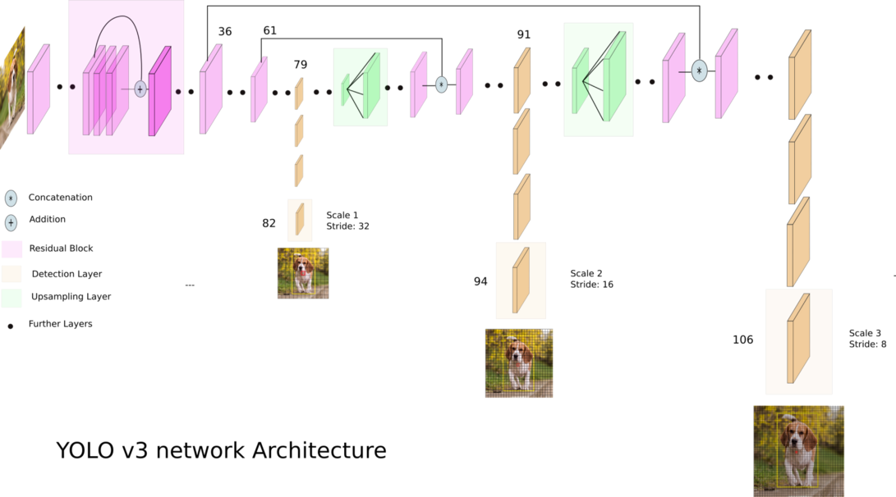
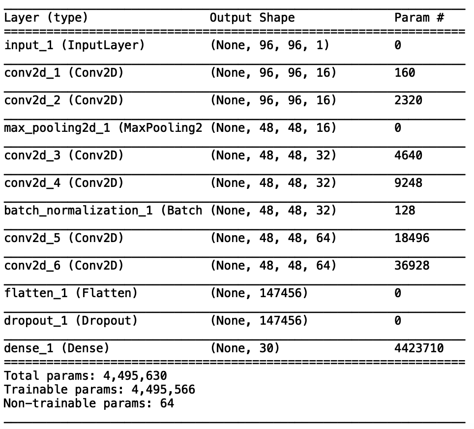
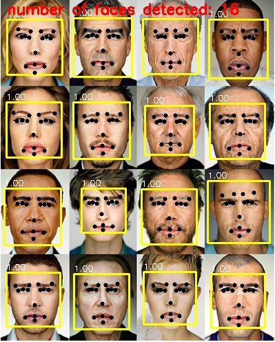

# Deep learning based Face recognition using the YOLOv3 + CONVO algorithms


## Getting started

The YOLOv3 (You Only Look Once) is a state-of-the-art, real-time object detection algorithm. The published model recognizes 80 different objects in images and videos. For more details, you can refer to this [paper](https://pjreddie.com/media/files/papers/YOLOv3.pdf).

We have combined YOLOv3 with conv model(CNN), which is trained for facial keypoints detection based on Kaggle.com Facial Keypoints Detection challenge dataset. 


## YOLOv3's architecture




## CONVO's architecture 


## OpenCV Deep Neural Networks (dnn module)

OpenCV `dnn` module supports running inference on pre-trained deep learning models from popular frameworks such as TensorFlow, Torch, Darknet and Caffe.

## Prerequisites

* Tensorflow
* opencv-python
* opencv-contrib-python
* Numpy
* Keras
* Matplotlib
* Pillow

Development for this project will be isolated in Python virtual environment. This allows us to experiment with different versions of dependencies.

There are many ways to install `virtual environment (virtualenv)`, see the [Python Virtual Environments: A Primer](https://realpython.com/python-virtual-environments-a-primer/) guide for different platforms, but here are a couple:

- For Ubuntu
```bash
$ pip install virtualenv
```

- For Mac
```bash
$ pip install --upgrade virtualenv
```

Create a Python 3.6 virtual environment for this project and activate the virtualenv:
```bash
$ virtualenv -p python3.6 yoloface
$ source ./yoloface/bin/activate
```

Next, install the dependencies for the this project:
```bash
$ pip install -r requirements.txt
```

## Usage

* Clone this repository
```bash
$ git clone https://github.com/InbalWeiss/Landscapes_in_Faces
```

* For face detection, you should download the pre-trained YOLOv3 weights file which trained on the [WIDER FACE: A Face Detection Benchmark](http://mmlab.ie.cuhk.edu.hk/projects/WIDERFace/index.html) dataset from this [link](https://drive.google.com/file/d/1xYasjU52whXMLT5MtF7RCPQkV66993oR/view?usp=sharing) and place it in the `model-weights/` directory.

* For Facial Keypoints Detection, you should download the pre-trained CONVO weights file which trained on the [Kaggle's 
Facial Keypoints Detection challenge](https://www.kaggle.com/c/facial-keypoints-detection/data) dataset from this [link](https://drive.google.com/open?id=1xbhMfMkf4vGHtArJRqiJsJDrb_ozq1pq) and place it in the `convo-weights/` directory.

* Run the following command:

>**image input**
```bash
$ python yoloface.py --image samples/outside_000001.jpg --output-dir outputs/
```

>**video input**
```bash
$ python yoloface.py --video samples/subway.mp4 --output-dir outputs/
```

>**webcam**
```bash
$ python yoloface.py --src 1 --output-dir outputs/
```

## Sample outputs



## References

